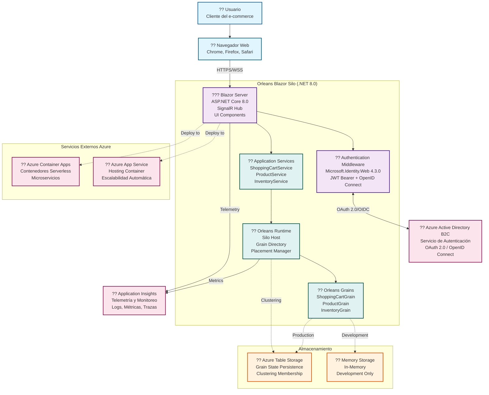

# Diagrama C4 Nivel 2: Contenedores - Orleans Blazor Shopping Cart (.NET 8.0)

## Descripción del Sistema
**Orleans Blazor Shopping Cart** es una aplicación de comercio electrónico construida con Microsoft Orleans (.NET 8.0) que utiliza el patrón Actor Model para manejar el estado distribuido del carrito de compras.

## Diagrama de Contenedores (C4 Level 2)



## Detalle de Contenedores

### ?? **Orleans Blazor Silo** (Contenedor Principal - .NET 8.0)
**Tecnología**: ASP.NET Core 8.0 + Microsoft Orleans  
**Responsabilidad**: Aplicación web completa con UI y lógica de negocio distribuida

**Sub-componentes:**
- **Blazor Server**: Frontend interactivo con SignalR
- **Authentication**: Microsoft.Identity.Web 4.3.0 
- **Services**: Capa de servicios de aplicación
- **Orleans Runtime**: Motor de actores distribuidos
- **Grains**: Actores de dominio (ShoppingCart, Product, Inventory)

### ?? **Navegador Web** (Contenedor Cliente)
**Tecnología**: HTML5, CSS, JavaScript, SignalR Client  
**Responsabilidad**: Interfaz de usuario reactiva

### ?? **Azure AD B2C** (Sistema Externo)
**Tecnología**: OAuth 2.0, OpenID Connect  
**Responsabilidad**: Autenticación y autorización de usuarios

### ?? **Azure Table Storage** (Contenedor de Datos)
**Tecnología**: NoSQL, Azure Storage  
**Responsabilidad**: Persistencia de estado de grains y clustering

### ?? **Application Insights** (Sistema Externo)
**Tecnología**: Telemetría Azure  
**Responsabilidad**: Monitoreo, logs y métricas

## Flujos de Datos Principales

### 1. **Flujo de Autenticación**
```
Usuario ? Browser ? Blazor Server ? Auth Middleware ? Azure B2C
```

### 2. **Flujo de Shopping Cart**
```
Browser ? Blazor Server ? ShoppingCartService ? Orleans Runtime ? ShoppingCartGrain ? Azure Storage
```

### 3. **Flujo de Productos**
```
Browser ? Blazor Server ? ProductService ? Orleans Runtime ? ProductGrain ? Azure Storage
```

### 4. **Flujo de Inventario**
```
Browser ? Blazor Server ? InventoryService ? Orleans Runtime ? InventoryGrain ? Azure Storage
```

## Características Técnicas (.NET 8.0)

### **Escalabilidad**
- Orleans permite escalamiento horizontal automático
- Grains se distribuyen automáticamente entre nodos
- State management distribuido y tolerante a fallos

### **Rendimiento**
- .NET 8.0 LTS con mejoras de rendimiento
- SignalR para comunicación en tiempo real
- Memory storage para desarrollo, Azure Storage para producción

### **Resiliencia**
- Orleans maneja automáticamente failover de grains
- Clustering membership automático
- Supervision tree para actores

## Patrones Arquitectónicos Utilizados

1. **Actor Model**: Implementado via Orleans Grains
2. **CQRS**: Separación entre comandos y consultas en grains
3. **Event Sourcing**: Potencial para auditoría de cambios
4. **Microservices**: Cada grain es un micro-servicio virtual
5. **Circuit Breaker**: Para manejo de fallos en servicios externos

## Decisiones de Arquitectura

### ? **Ventajas de Orleans**
- Estado distribuido sin complejidad de coordinación
- Escalabilidad automática y transparente
- Modelo de programación simplificado para sistemas distribuidos
- Tolerancia a fallos built-in

### ?? **Consideraciones**
- Curva de aprendizaje para Orleans
- Dependencia del runtime Orleans
- Debugging distribuido puede ser complejo
- Requiere diseño cuidadoso de grain boundaries