# Diagrama C4 Nivel 3: Componentes - Orleans Blazor Shopping Cart (.NET 8.0)

## Descripción
Este diagrama muestra la **estructura interna detallada** del contenedor principal "Orleans Blazor Silo", descomponiendo cada capa en sus componentes específicos y mostrando las interacciones entre ellos.

## Diagrama de Componentes (C4 Level 3)

```mermaid
graph TB
    %% External Systems
    User[?? Usuario]
    Browser[?? Navegador Web<br/>SignalR Client]
    B2C[?? Azure AD B2C<br/>OAuth/OIDC Provider]
    AppInsights[?? Application Insights<br/>Telemetría]

    subgraph "Orleans Blazor Silo Container (.NET 8.0)"
        direction TB
        
        %% Presentation Layer Components
        subgraph "??? Presentación (Blazor Server)"
            direction TB
            SignalRHub[?? Blazor SignalR Hub<br/>Real-time Communication<br/>Circuit Management]
            
            subgraph "Blazor Pages"
                IndexPage[?? Index.razor<br/>Landing Page]
                ShopPage[?? Shop.razor<br/>Product Catalog<br/>Add to Cart]
                CartPage[?? Cart.razor<br/>Shopping Cart View<br/>Checkout Management]
                ProductsPage[?? Products.razor<br/>Product Management<br/>CRUD Operations]
                AuthPage[?? AuthorizedOrLogin.razor<br/>Auth Wrapper Component]
            end
            
            subgraph "Blazor Components"
                ProductTable[?? ProductTable.razor<br/>Product Grid Display]
                PurchasableTable[??? PurchasableProductTable.razor<br/>Shop Product Grid]
                CartItem[??? ShoppingCartItem.razor<br/>Cart Item Display]
                CartSummary[?? ShoppingCartSummary.razor<br/>Cart Totals & Checkout]
                ProductModal[?? ManageProductModal.razor<br/>Product CRUD Form]
                LoginDisplay[?? LoginDisplay.razor<br/>User Authentication UI]
                NavMenu[?? NavMenu.razor<br/>Navigation Menu]
                MainLayout[?? MainLayout.razor<br/>App Shell Layout]
            end
        end

        %% Authentication Layer
        subgraph "?? Autenticación (.NET 8.0)"
            direction TB
            AuthMiddleware[??? Authentication Middleware<br/>Microsoft.Identity.Web 4.3.0<br/>Cookie & JWT Handler]
            AuthConfig[?? Authentication Config<br/>Azure B2C Settings<br/>Cookie Security Policy]
            AuthorizeAttribute[?? Authorization Filters<br/>Policy-based Authorization]
        end

        %% Service Layer Components
        subgraph "?? Servicios de Aplicación"
            direction TB
            ShoppingCartSvc[?? ShoppingCartService<br/>Cart Operations<br/>Grain Client Wrapper]
            ProductSvc[?? ProductService<br/>Product Operations<br/>Grain Client Wrapper]
            InventorySvc[?? InventoryService<br/>Inventory Operations<br/>Grain Client Wrapper]
            ToastSvc[?? ToastService<br/>UI Notifications<br/>User Feedback]
            ObserverSvc[?? ComponentStateChangedObserver<br/>Real-time Updates<br/>SignalR Notifications]
        end

        %% Orleans Layer Components
        subgraph "?? Orleans Runtime (.NET 8.0)"
            direction TB
            
            subgraph "Orleans Infrastructure"
                SiloHost[?? Silo Host<br/>Orleans Application Host<br/>Grain Activation Manager]
                GrainDirectory[?? Grain Directory<br/>Grain Location Registry<br/>Distributed Hash Table]
                PlacementMgr[?? Placement Manager<br/>Grain Distribution Logic<br/>Load Balancing]
                ClusterMgr[?? Cluster Manager<br/>Membership Protocol<br/>Failure Detection]
                MessageRouter[?? Message Router<br/>Grain Communication<br/>Request Routing]
            end
            
            subgraph "Grain Factory & Client"
                GrainFactory[?? Grain Factory<br/>Grain Reference Creator<br/>Proxy Generator]
                ClusterClient[?? Cluster Client<br/>Orleans Gateway<br/>Request Dispatcher]
            end
        end

        %% Domain Layer (Orleans Grains)
        subgraph "?? Dominio (Orleans Grains)"
            direction TB
            
            subgraph "Shopping Cart Boundary"
                CartGrain[?? ShoppingCartGrain<br/>Cart State Management<br/>Item Operations<br/>Persistent State]
                CartState[?? Cart Persistent State<br/>Dictionary<string, CartItem><br/>Azure Table Storage]
            end
            
            subgraph "Product Boundary"
                ProductGrain[?? ProductGrain<br/>Product Information<br/>Inventory Management<br/>CRUD Operations]
                ProductState[?? Product Persistent State<br/>ProductDetails Record<br/>Azure Table Storage]
            end
            
            subgraph "Inventory Boundary"
                InventoryGrain[?? InventoryGrain<br/>Category Management<br/>Product Aggregation<br/>Cache Management]
                InventoryState[?? Inventory Persistent State<br/>HashSet<string> ProductIds<br/>Azure Table Storage]
                InventoryCache[?? In-Memory Cache<br/>Dictionary<string, ProductDetails><br/>Performance Optimization]
            end
        end

        %% Cross-cutting Concerns
        subgraph "?? Concerns Transversales"
            direction LR
            Logging[?? Logging<br/>ILogger<T><br/>Structured Logging]
            Telemetry[?? Telemetry<br/>ApplicationInsights SDK<br/>Custom Metrics]
            ErrorHandling[?? Error Handling<br/>Exception Middleware<br/>Circuit Breaker Pattern]
        end
    end

    %% External Storage
    subgraph "?? Almacenamiento Externo"
        direction TB
        AzureStorage[?? Azure Table Storage<br/>Grain State Persistence<br/>Clustering Membership<br/>NoSQL Document Store]
        MemoryStorage[?? Memory Storage<br/>Development Only<br/>In-Process Storage]
    end

    %% User Flow Connections
    User --> Browser
    Browser <-->|HTTPS/WSS| SignalRHub
    
    %% Authentication Flow
    SignalRHub --> AuthMiddleware
    AuthMiddleware <-->|OAuth 2.0/OIDC| B2C
    AuthMiddleware --> AuthConfig
    AuthMiddleware --> AuthorizeAttribute
    
    %% Page Navigation
    SignalRHub --> IndexPage
    SignalRHub --> ShopPage
    SignalRHub --> CartPage
    SignalRHub --> ProductsPage
    SignalRHub --> AuthPage
    
    %% Component Dependencies
    ShopPage --> PurchasableTable
    CartPage --> CartItem
    CartPage --> CartSummary
    ProductsPage --> ProductTable
    ProductsPage --> ProductModal
    AuthPage --> LoginDisplay
    SignalRHub --> NavMenu
    SignalRHub --> MainLayout
    
    %% Service Layer Connections
    ShopPage --> ShoppingCartSvc
    ShopPage --> ProductSvc
    CartPage --> ShoppingCartSvc
    ProductsPage --> ProductSvc
    ProductsPage --> InventorySvc
    
    %% Orleans Service to Runtime
    ShoppingCartSvc --> ClusterClient
    ProductSvc --> ClusterClient
    InventorySvc --> ClusterClient
    
    %% Orleans Runtime Internal
    ClusterClient --> GrainFactory
    GrainFactory --> GrainDirectory
    GrainDirectory --> PlacementMgr
    PlacementMgr --> SiloHost
    ClusterClient --> MessageRouter
    MessageRouter --> ClusterMgr
    
    %% Grain Interactions
    GrainFactory --> CartGrain
    GrainFactory --> ProductGrain
    GrainFactory --> InventoryGrain
    
    %% Inter-Grain Communication
    CartGrain -.->|GetGrain<IProductGrain>| ProductGrain
    ProductGrain -.->|GetGrain<IInventoryGrain>| InventoryGrain
    
    %% State Persistence
    CartGrain --> CartState
    ProductGrain --> ProductState
    InventoryGrain --> InventoryState
    InventoryGrain --> InventoryCache
    
    %% Storage Connections
    CartState -.->|Production| AzureStorage
    ProductState -.->|Production| AzureStorage
    InventoryState -.->|Production| AzureStorage
    CartState -.->|Development| MemoryStorage
    ProductState -.->|Development| MemoryStorage
    InventoryState -.->|Development| MemoryStorage
    
    %% Monitoring & Observability
    ObserverSvc --> SignalRHub
    ToastSvc --> SignalRHub
    Logging --> AppInsights
    Telemetry --> AppInsights
    ErrorHandling --> AppInsights
    
    %% Cross-cutting Concerns
    CartGrain --> Logging
    ProductGrain --> Logging
    InventoryGrain --> Logging
    ShoppingCartSvc --> Telemetry
    ProductSvc --> Telemetry
    InventorySvc --> Telemetry

    %% Styling
    classDef userClass fill:#e1f5fe,stroke:#01579b,stroke-width:2px
    classDef presentationClass fill:#f3e5f5,stroke:#4a148c,stroke-width:2px
    classDef authClass fill:#ffebee,stroke:#c62828,stroke-width:2px
    classDef serviceClass fill:#e8f5e8,stroke:#1b5e20,stroke-width:2px
    classDef orleansClass fill:#e0f2f1,stroke:#004d40,stroke-width:3px
    classDef grainClass fill:#fff3e0,stroke:#ef6c00,stroke-width:2px
    classDef storageClass fill:#fce4ec,stroke:#880e4f,stroke-width:2px
    classDef crossCuttingClass fill:#f1f8e9,stroke:#33691e,stroke-width:2px
    classDef externalClass fill:#e8eaf6,stroke:#283593,stroke-width:2px

    class User,Browser userClass
    class SignalRHub,IndexPage,ShopPage,CartPage,ProductsPage,AuthPage,ProductTable,PurchasableTable,CartItem,CartSummary,ProductModal,LoginDisplay,NavMenu,MainLayout presentationClass
    class AuthMiddleware,AuthConfig,AuthorizeAttribute authClass
    class ShoppingCartSvc,ProductSvc,InventorySvc,ToastSvc,ObserverSvc serviceClass
    class SiloHost,GrainDirectory,PlacementMgr,ClusterMgr,MessageRouter,GrainFactory,ClusterClient orleansClass
    class CartGrain,ProductGrain,InventoryGrain,CartState,ProductState,InventoryState,InventoryCache grainClass
    class Logging,Telemetry,ErrorHandling crossCuttingClass
    class AzureStorage,MemoryStorage,B2C,AppInsights externalClass
```



## Detalle de Componentes por Capa

### ??? **Capa de Presentación (Blazor Server)**

#### **SignalR Hub**
- **Responsabilidad**: Gestión de circuitos Blazor, comunicación en tiempo real
- **Tecnología**: ASP.NET Core SignalR, WebSockets
- **Patrones**: Circuit Management, Real-time Updates

#### **Páginas Blazor**
| Componente | Responsabilidad | Rutas |
|------------|----------------|-------|
| `Index.razor` | Página de inicio | `/` |
| `Shop.razor` | Catálogo de productos, agregar al carrito | `/shop` |
| `Cart.razor` | Vista del carrito, gestión de items | `/cart` |
| `Products.razor` | Administración de productos | `/products` |
| `AuthorizedOrLogin.razor` | Wrapper de autorización | - |

#### **Componentes Reutilizables**
| Componente | Función | Usado En |
|------------|---------|----------|
| `ProductTable` | Grid de productos con CRUD | Products.razor |
| `PurchasableProductTable` | Grid de productos comprables | Shop.razor |
| `ShoppingCartItem` | Item individual del carrito | Cart.razor |
| `ShoppingCartSummary` | Resumen y totales del carrito | Cart.razor |
| `ManageProductModal` | Formulario modal CRUD producto | Products.razor |

### ?? **Capa de Autenticación**

#### **Authentication Middleware**
- **Tecnología**: Microsoft.Identity.Web 4.3.0
- **Protocolos**: OAuth 2.0, OpenID Connect, JWT Bearer
- **Características**: Cookie security, SameSite policies

#### **Configuración de Seguridad**
```csharp
// Cookie Security Configuration
cookie.SameSite = SameSiteMode.None;
cookie.SecurePolicy = CookieSecurePolicy.Always;
cookie.IsEssential = true;
```

### ?? **Capa de Servicios de Aplicación**

#### **ShoppingCartService**
- **Métodos**: `AddOrUpdateItemAsync`, `RemoveItemAsync`, `GetAllItemsAsync`, `EmptyCartAsync`
- **Patrón**: Repository pattern con Orleans Grains
- **Error Handling**: Try-catch con fallbacks

#### **ProductService & InventoryService**
- **Función**: Abstracción sobre Orleans Grains
- **Beneficios**: Desacoplamiento, testing, error handling

#### **Servicios de UI**
- **ToastService**: Notificaciones de usuario
- **ComponentStateChangedObserver**: Updates en tiempo real via SignalR

### ?? **Capa Orleans Runtime**

#### **Infrastructure Components**
| Componente | Función |
|------------|---------|
| **Silo Host** | Host principal de Orleans, gestión de grains |
| **Grain Directory** | Registro distribuido de ubicación de grains |
| **Placement Manager** | Algoritmos de distribución de grains |
| **Cluster Manager** | Gestión de membresía del cluster |
| **Message Router** | Enrutamiento de mensajes entre grains |

#### **Client Components**
- **Grain Factory**: Creación de referencias a grains
- **Cluster Client**: Gateway para comunicación con grains

### ?? **Capa de Dominio (Orleans Grains)**

#### **ShoppingCartGrain**
```csharp
// Persistent State
IPersistentState<Dictionary<string, CartItem>> _cart

// Key Operations
- AddOrUpdateItemAsync(quantity, product)
- RemoveItemAsync(product) 
- GetAllItemsAsync()
- EmptyCartAsync()
```

#### **ProductGrain**
```csharp
// Persistent State
IPersistentState<ProductDetails> _product

// Key Operations
- CreateOrUpdateProductAsync(productDetails)
- TryTakeProductAsync(quantity) // Inventory management
- ReturnProductAsync(quantity)  // Return to inventory
```

#### **InventoryGrain**
```csharp
// Persistent State + Cache
IPersistentState<HashSet<string>> _productIds
Dictionary<string, ProductDetails> _productCache

// Key Operations
- AddOrUpdateProductAsync(product)
- GetAllProductsAsync() // From cache
- PopulateProductCacheAsync() // Parallel loading
```

### ?? **Gestión de Estado**

#### **Persistent State Pattern**
- **Storage Provider**: Azure Table Storage (prod) / Memory (dev)
- **Consistency**: Strong consistency per grain
- **Persistence**: Automatic state write-behind

#### **Caching Strategy**
- **InventoryGrain**: In-memory cache para performance
- **Parallel Loading**: Uso de `Parallel.ForEachAsync` con TaskScheduler.Current

### ?? **Patrones Arquitectónicos Implementados**

#### **1. Actor Model (Orleans Grains)**
- Cada grain es un actor virtual
- Encapsulación de estado y comportamiento
- Single-threaded execution per grain

#### **2. CQRS (Command Query Responsibility Segregation)**
- Separación clara entre comandos y queries
- ShoppingCartGrain: Commands (Add/Remove) vs Queries (GetAll)

#### **3. Repository Pattern**
- Services actúan como repositories
- Abstracción sobre Orleans Grains
- Facilita testing y error handling

#### **4. Observer Pattern**
- ComponentStateChangedObserver para updates UI
- Real-time notifications via SignalR

#### **5. Circuit Breaker Pattern**
- Error handling en services
- Graceful degradation cuando grains fallan

### ?? **Optimizaciones de Rendimiento (.NET 8.0)**

#### **Orleans Optimizations**
- **Reentrant Grains**: `[Reentrant]` para ShoppingCartGrain
- **Parallel Operations**: InventoryGrain cache loading
- **Grain State Caching**: Reduced storage roundtrips

#### **.NET 8.0 Benefits**
- Improved garbage collection
- Better SignalR performance
- Enhanced async/await performance
- Reduced memory allocations

### ?? **Observabilidad y Monitoreo**

#### **Structured Logging**
- ILogger<T> en todos los componentes
- Correlation IDs para request tracking
- Performance counters para Orleans

#### **Application Insights Integration**
- Custom metrics para business operations
- Dependency tracking para Orleans calls
- Exception tracking con full stack traces

### ?? **Configuración por Ambiente**

#### **Development**
```csharp
// Orleans Configuration
builder.UseLocalhostClustering()
    .AddMemoryGrainStorage("shopping-cart")
    .AddStartupTask<SeedProductStoreTask>();
```

#### **Production**
```csharp
// Orleans Configuration
builder.UseAzureStorageClustering(connectionString)
    .AddAzureTableGrainStorage("shopping-cart", connectionString)
    .ConfigureEndpoints(siloPort, gatewayPort);
```

## Flujos de Datos Detallados

### ?? **Flujo Completo: Agregar Producto al Carrito**
```
1. User clicks "Add to Cart" ? PurchasableProductTable
2. PurchasableProductTable ? ShoppingCartService.AddOrUpdateItemAsync
3. ShoppingCartService ? ClusterClient.GetGrain<IShoppingCartGrain>
4. GrainFactory ? GrainDirectory (locate grain)
5. ShoppingCartGrain.AddOrUpdateItemAsync
6. ShoppingCartGrain ? ProductGrain.TryTakeProductAsync (inventory check)
7. ProductGrain updates inventory ? InventoryGrain.AddOrUpdateProductAsync
8. ShoppingCartGrain ? PersistentState.WriteStateAsync ? Azure Storage
9. ComponentStateChangedObserver ? SignalR update ? UI refresh
```

### ?? **Flujo: Gestión de Inventario**
```
1. ProductGrain state change
2. ProductGrain ? InventoryGrain.AddOrUpdateProductAsync
3. InventoryGrain updates cache + persistent state
4. Parallel cache population on activation
5. Real-time UI updates via Observer pattern
```

Este diagrama de componentes muestra la arquitectura interna completa, permitiendo entender cómo cada pieza interactúa para crear una aplicación Orleans distribuida y escalable.